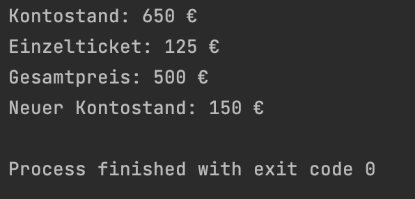

# Grundlagen Woche 1, Tag 5: Praxisfreitag

  

#### Beschreibung:

Gratulation, ihr seid jetzt bereits seit einer Woche Programmierer!
Heute am 1. Praxisfreitag wollen wir die Inhalte der Woche anhand von einem "realistischem" Beispiel wiederholen.

Im heutigen Projekt wirst du einige Funktionen für eine hypothetische Fluggesellschaft implementieren. 
Um auch tatsächlich unbeschwert in den Urlaub zu fliegen, sollst du einen Boarding Pass "digitalisiert" in der Konsole ausgeben. 
Außerdem wirst du die Ticketpreise berechnen und herausfinden, ob sich der Flug auch für die Airline lohnt. 

#### Hinweise zur Bearbeitung:

- Achte auf Namenskonventionen und sauberen Quellcode, insbesondere Einrückungen sind wichtig!
- Bitte push am Ende des Tages umbedingt dein Projekt zu Github. 
---

 <b> Aufgabe 1 - Vorbereitung  </b> 

Normalerweise beginnt jede App damit, dass du erstmal ein Projekt erstellen musst. 
Heute haben wir das bereits für dich übernommen. Aber es fehlen noch die Dateien, in denen du die Aufgaben lösen wirst. 
Erstelle also 3 Kotlin (.kt) Dateien im Ordner "src". 
Die Dateien sollen folgende Namen haben: "Passagier", "Bezahlung", "Airline".
Erstelle in jeder der Dateien eine main-Funktion, in der du die jeweiligen Aufgaben bearbeiten wirst.

---

 <b> Aufgabe 2 - Passagierinformation </b> 

Damit die Fluggesellschaft einen komfortablen Flug bieten kann, benötigt sie ein paar Informationen über die Passagiere. 
Bei Verspätungen oder Nicht-Erscheinen, sind beispielsweise Kontaktdaten von Vorteil. 
Um den Kunden auch ein gutes gastronomisches Angebot zu machen, ist es für die Fluggesellschaft außerdem gut zu wissen, ob die Kunden vegetarisch sind.
- Erstelle die 7 folgenden Variablen mit den passenden Datentypen: name, vorname, email, telefonnummer, geburtsjahr, reiseziel, vegetarisch.
- Diese Variablen sollen über Konsoleneingaben befüllt werden.
- Achtet auf sinnvolle Datentypen der einzelnen Variablen!
- Anschließend sollst du einen sogenannten <ins>*Boarding Pass*</ins> auf der Konsole ausgeben.

**Datei für die Aufgabe:** *Passagier.kt*

Dein Ergebnis könnte z.B so aussehen:

---

 <b> Aufgabe 3 - Ticket kaufen </b> 

Deine Lieblingsfluggesellschaft bietet einen Hin- und Rückflug für eine 4-köpfige Familie. Ein Ticket kostet 125Euro pro Passagier und dein Kontostand beträgt 650Euro.
- Erstelle die benötigten Variablen, um die Tickets zu kaufen.
- Berechne den Gesamtpreis und den finalen Kontostand. Speichere diese in passenden Variablen und gib sie auf der Konsole aus.

  **Datei für die Aufgabe:** *Bezahlung.kt*

Dein Ergebnis könnte z.B so aussehen:

  

---

 <b> Aufgabe 4 - Airline  </b> 

- Das Flugzeug hat 130 Sitzplätze, wieviele 4-köpfige Familien können mit dem Flugzeug mitgenommen werden? Gib das Ergebnis auf der Konsole aus.
- Wie viele freie Sitzplätze gibt es, wenn 25 4-köpfige Familien die Tickets kaufen? Gib das Ergebnis auf der Konsole aus.
- Der Flug kostet die Fluggesellschaft 16€ pro Kilometer. Die Flugstrecke von Berlin nach Mailand beträgt 1034.93 Kilometer. Wie teuer ist der Flug?
  Gib das Ergebnis auf der Konsole aus.
- Bringt dieser Flug der Fluggesellschaft einen Gewinn, wenn 130 Passagiere mitfliegen?

**Hinweis**: Überlege dir wann es sinnvoll ist, Variablen und Konstanten anzulegen.

**Datei für die Aufgabe:** *Airline.kt*

Dein Ergebnis könnte z.B so aussehen:

---
